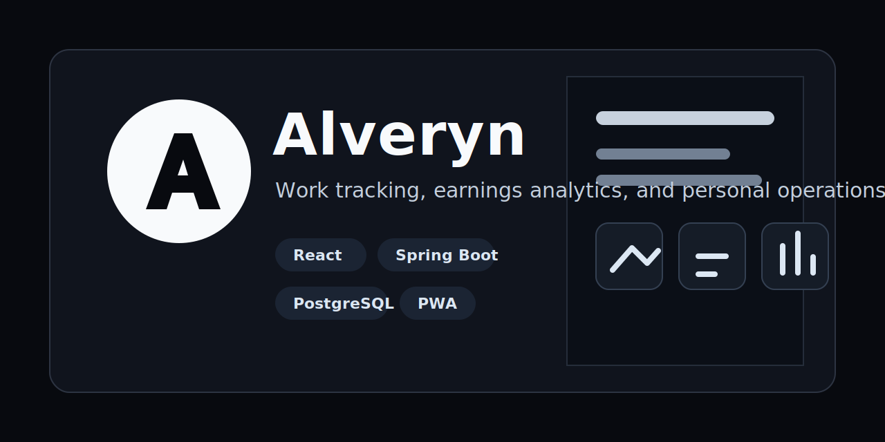

# Alveryn



[](https://github.com/ejacot/alveryn/actions/workflows/backend-ci.yml)
[](https://alveryn.com)
[](https://api.alveryn.com/actuator/health)

Alveryn is a work tracking and earnings analytics application for people who need a precise view of time, unit-based work, rates, absences, salary periods, and statistics.

The project is organized as a Spring Boot backend plus a Vite/React frontend, with production infrastructure for Render.

## Product

- Track time-based and unit-based work entries.
- Model personal work types, rates, calculation methods, formula groups, and salary periods.
- Review dashboard, calendar, and settings; the statistics workspace is currently marked as coming soon while it is being finalized.
- Support registration, email verification, onboarding, JWT auth, refresh cookies, and production email delivery.
- Run as a deployable web app with PWA assets and mobile-focused flows.

## Stack

- Backend: Java 21, Spring Boot, Spring Security, Hibernate, Flyway, PostgreSQL, MapStruct.
- Frontend: React, TypeScript, Vite, React Router, TanStack Query, React Hook Form, Zod, TailwindCSS, Framer Motion.
- Testing and CI: Maven tests, Vitest, Playwright, GitHub Actions, PostgreSQL service containers.
- Deployment: Render Blueprint, managed PostgreSQL, static frontend, Dockerized API.

## Links

- Production app: <https://alveryn.com>
- Production API health: <https://api.alveryn.com/actuator/health>
- Deployment notes: [docs/deployment.md](docs/deployment.md)
- Architecture notes: [docs/architecture.md](docs/architecture.md)
- API notes: [docs/api.md](docs/api.md)

## Local development

1. Copy `.env.example` to `.env` if local overrides are needed. The backend imports `.env` automatically in local development.
2. Start PostgreSQL with `docker compose up -d postgres`.
3. Set local mail variables if email delivery should work end-to-end: `MAIL_HOST`, `MAIL_PORT`, `MAIL_USERNAME`, `MAIL_PASSWORD`, and `MAIL_STARTTLS`.
4. Start the backend from `backend` with `SPRING_PROFILES_ACTIVE=local ./mvnw spring-boot:run` on Unix-like systems or the equivalent local profile configuration in IntelliJ IDEA / Windows.
5. Start the frontend from `frontend` with `npm install` once, then `npm run dev`.

For local development, the backend defaults to `jdbc:postgresql://localhost:5432/alveryn` with username `alveryn` and password `change-me`. The `local` Spring profile also provides a development-only JWT secret so the application can start locally once PostgreSQL is running. Gmail SMTP defaults for host, port, username, and STARTTLS are supplied only in the `local` profile; the app password must still come from `MAIL_PASSWORD`.

### Local development account

When the backend starts with `SPRING_PROFILES_ACTIVE=local`, `LocalDevelopmentAccountSeeder` can create the local verified developer account, profile, and preferences automatically if the account does not already exist. This is enabled by default. Set `ALVERYN_LOCAL_DEV_SEED_ACCOUNT=false` in `.env` when you want to test registration from an empty database. Existing local account data is not reset on startup. To deliberately reset that local account, start the backend with `ALVERYN_LOCAL_DEV_RESET_ACCOUNT=true`.

This is a Spring `@Profile("local")` bootstrap component, not a Flyway migration, so staging and production never create this account. Production-style runs without the `local` profile execute only environment-neutral Flyway migrations. Migration `V11__remove_local_development_account.sql` is intentionally reserved/no-op and does not delete user data.

If an existing local database reports a Flyway checksum mismatch for the old V9 seed or the reserved V11 migration, rebuild the local database or run Flyway repair once against that local database after pulling this change:

```bash
cd backend
./mvnw flyway:repair -Dflyway.url=jdbc:postgresql://localhost:5432/alveryn -Dflyway.user=alveryn -Dflyway.password=change-me -Dflyway.locations=classpath:db/migration
```

New local databases do not need this. Playwright creates isolated users for browser tests and does not depend on this local account.

The backend uses Java 21, PostgreSQL, Flyway, Hibernate, and the Java package `com.alveryn.api`.

## Frontend local workflow

The frontend uses Vite, React Router, TanStack Query, React Hook Form, Zod, Axios, TailwindCSS, and Framer Motion.

### Local commands

1. Start PostgreSQL:
   `docker compose up -d postgres`
2. Start the backend in another shell:
   `cd backend && SPRING_PROFILES_ACTIVE=local ./mvnw spring-boot:run`
3. Start the frontend in another shell:
   `cd frontend && npm install && npm run dev`
4. Open the app:
   `http://localhost:5173`

### Frontend environment

The frontend reads environment values from `frontend/.env` or `frontend/.env.local`. Copy `frontend/.env.example` when local overrides are needed.

- `VITE_DEV_PROXY_TARGET`
  Dev-only backend target for the Vite proxy. Default: `http://localhost:8080`
- `VITE_API_BASE_URL`
  Optional explicit API base URL. Leave empty for local development so the frontend uses the Vite proxy and same-origin `/api` requests.
- `VITE_ENABLE_PREVIEW_ROUTES`
  Enables local preview routes outside `import.meta.env.DEV` when set to `true`.

### Local API strategy

Local development uses a Vite proxy, not browser-to-backend CORS. The frontend sends same-origin `/api` requests to the Vite server, and Vite forwards them to the backend target from `VITE_DEV_PROXY_TARGET`. This keeps local origins simple and avoids maintaining a second CORS-specific dev path.

### Backend environment

Required backend variables for full auth/email flows:

- `DB_URL`
- `DB_USERNAME`
- `DB_PASSWORD`
- `MAIL_PASSWORD`

Optional backend variables:

- `MAIL_HOST`
- `MAIL_PORT`
- `MAIL_USERNAME`
- `MAIL_STARTTLS`
- `ACCESS_TOKEN_LIFETIME`
- `REFRESH_TOKEN_LIFETIME`
- `EMAIL_VERIFICATION_CODE_LIFETIME`
- `PASSWORD_RESET_CODE_LIFETIME`
- `VERIFICATION_RESEND_COOLDOWN`
- `LOGIN_MAX_FAILED_ATTEMPTS`
- `LOGIN_LOCK_DURATION`
- `FRONTEND_VERIFICATION_URL`

## Configuration

The backend accepts `DB_URL`, `DB_USERNAME`, `DB_PASSWORD`, `JWT_SECRET`, `MAIL_HOST`, `MAIL_PORT`, `MAIL_USERNAME`, `MAIL_PASSWORD`, and `MAIL_STARTTLS`. `DB_URL` must be a JDBC URL such as `jdbc:postgresql://host:5432/alveryn`. `JWT_SECRET` is required outside the `local` profile and must be a sufficiently long secret value. Local defaults are provided for database development only; deployment environments should supply their own values.

GitHub Actions provisions an isolated PostgreSQL 17 service and needs no repository secrets. Render deployment is described by `render.yaml`; set `DB_URL` once to the managed database's internal JDBC URL (`jdbc:postgresql://host:5432/database`), while username and password are linked automatically. Render builds with `backend/` as Docker context, checks `/actuator/health`, and provides `PORT` to Spring Boot.
