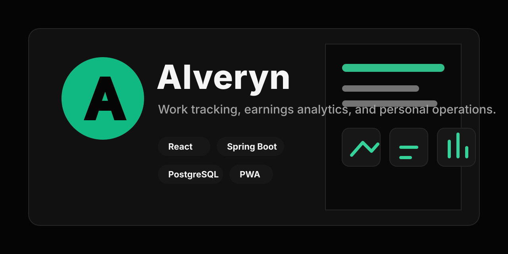

# Alveryn



[](https://github.com/ejacot/alveryn/actions/workflows/backend-ci.yml)
[](https://alveryn.com)
[](https://api.alveryn.com/actuator/health)

Alveryn is a privacy-minded work, activity, and earnings tracker for people who need a precise view of hours, unit-based work, projects, rates, absences, rest days, payroll periods, and gross earnings.

The product combines a mobile-first PWA, a Spring Boot API, PostgreSQL, deterministic document analysis, and optional task-focused AI assistance. Production infrastructure is defined for Render.

## Product

- Track time-based and unit-based work entries.
- Organize multi-day projects with project totals and day-specific work sessions.
- Model personal work types, rates, calculation methods, formula groups, and salary periods.
- Classify calendar days as worked, absent, or rest days without distorting statistics.
- Import existing records from XLSX, TXT, PDF, JPG, PNG, or WEBP through a review-first workflow.
- Detect work types, aliases, absences, rest days, surcharges, periods, and ambiguous entries before writing data.
- Compare a monthly payslip with Alveryn, preserve the uploaded evidence, and save reconciliation differences.
- Export detailed employer-ready PDF reports with per-activity time or unit breakdowns.
- Review dashboard, calendar, advanced statistics, and settings through responsive phone, tablet, and desktop layouts.
- Support registration, email verification, onboarding, JWT auth, refresh cookies, and production email delivery.
- Run as an installable PWA with an accessible premium visual system in dark and light themes.
- Use the interface in English, German, Romanian, or Russian.

## Import safety model

Imports are staged rather than written directly to work records. Alveryn analyzes the source, asks only for unresolved meaning, lets the user map or create work types and absence types, presents a final preview, skips known duplicates, and requires explicit confirmation before execution.

Deterministic parsing remains the foundation for structured spreadsheets and text. Optional AI assistance is narrowly scoped to interpreting unclear user explanations and extracting rows from visual documents. AI does not silently apply corrections or bypass the confirmation workflow. Original source documents and saved payroll reconciliation documents can be reopened for later verification.

## Stack

- Backend: Java 21, Spring Boot, Spring Security, Hibernate, Flyway, PostgreSQL, MapStruct.
- Frontend: React, TypeScript, Vite, React Router, TanStack Query, React Hook Form, Zod, TailwindCSS, Framer Motion.
- Document processing: Apache POI, PDFBox, optional Groq-compatible text and vision models.
- Testing and CI: Maven, Vitest, Playwright, GitHub Actions, PostgreSQL service containers, production Docker build verification.
- Deployment: Render Blueprint, managed PostgreSQL, static frontend, Dockerized API.

## Links

- Production app: <https://alveryn.com>
- Production API health: <https://api.alveryn.com/actuator/health>
- Deployment notes: [docs/deployment.md](docs/deployment.md)
- Architecture notes: [docs/architecture.md](docs/architecture.md)
- API notes: [docs/api.md](docs/api.md)
- Release process: [docs/releasing.md](docs/releasing.md)

## Versioning and releases

Alveryn uses Semantic Versioning with `VERSION` as the canonical version shared
by the frontend and backend. Development is integrated through `develop`,
production is deployed from `main`, and official versions are published as
immutable `v*` Git tags and GitHub Releases. See the
[release guide](docs/releasing.md) and [changelog](CHANGELOG.md).

## Local development

Requirements: Java 21, Node.js 22, Docker, and Docker Compose.

1. Copy `.env.example` to `.env` and adjust local values when needed.
2. Start PostgreSQL: `docker compose up -d postgres`.
3. Start the API: `cd backend && SPRING_PROFILES_ACTIVE=local ./mvnw spring-boot:run`.
4. In another shell, start the PWA: `cd frontend && npm install && npm run dev`.
5. Open <http://localhost:5173>.

For local development, the backend defaults to `jdbc:postgresql://localhost:5432/alveryn` with username `alveryn` and password `change-me`. The `local` Spring profile also provides a development-only JWT secret so the application can start locally once PostgreSQL is running. Gmail SMTP defaults for host, port, username, and STARTTLS are supplied only in the `local` profile; the app password must still come from `MAIL_PASSWORD`.

### Local development account

When the backend starts with `SPRING_PROFILES_ACTIVE=local`, `LocalDevelopmentAccountSeeder` can create the local verified developer account, profile, and preferences automatically if the account does not already exist. This is enabled by default. Set `ALVERYN_LOCAL_DEV_SEED_ACCOUNT=false` in `.env` when you want to test registration from an empty database. Existing local account data is not reset on startup. To deliberately reset that local account, start the backend with `ALVERYN_LOCAL_DEV_RESET_ACCOUNT=true`.

This is a Spring `@Profile("local")` bootstrap component, not a Flyway migration, so staging and production never create this account. Production-style runs without the `local` profile execute only environment-neutral Flyway migrations. Migration `V11__remove_local_development_account.sql` is intentionally reserved/no-op and does not delete user data.

If an existing local database reports a Flyway checksum mismatch for the old V9 seed or the reserved V11 migration, rebuild the local database or run Flyway repair once against that local database after pulling this change:

```bash
cd backend
./mvnw flyway:repair -Dflyway.url=jdbc:postgresql://localhost:5432/alveryn -Dflyway.user=alveryn -Dflyway.password=change-me -Dflyway.locations=classpath:db/migration
```

New local databases do not need this. Playwright creates isolated users for browser tests and does not depend on this local account.

The backend uses Java 21, PostgreSQL, Flyway, Hibernate, and the Java package `com.alveryn.api`.

### Frontend environment

The frontend reads environment values from `frontend/.env` or `frontend/.env.local`. Copy `frontend/.env.example` when local overrides are needed.

- `VITE_DEV_PROXY_TARGET`
  Dev-only backend target for the Vite proxy. Default: `http://localhost:8080`
- `VITE_API_BASE_URL`
  Optional explicit API base URL. Leave empty for local development so the frontend uses the Vite proxy and same-origin `/api` requests.
- `VITE_ENABLE_PREVIEW_ROUTES`
  Enables local preview routes outside `import.meta.env.DEV` when set to `true`.

### Local API strategy

Local development uses a Vite proxy, not browser-to-backend CORS. The frontend sends same-origin `/api` requests to the Vite server, and Vite forwards them to the backend target from `VITE_DEV_PROXY_TARGET`. This keeps local origins simple and avoids maintaining a second CORS-specific dev path.

### Backend environment

Required backend variables for full auth/email flows:

- `DB_URL`
- `DB_USERNAME`
- `DB_PASSWORD`
- `MAIL_PASSWORD`

Optional backend variables:

- `MAIL_HOST`
- `MAIL_PORT`
- `MAIL_USERNAME`
- `MAIL_FROM`
- `MAIL_STARTTLS`
- `ACCESS_TOKEN_LIFETIME`
- `REFRESH_TOKEN_LIFETIME`
- `EMAIL_VERIFICATION_CODE_LIFETIME`
- `PASSWORD_RESET_CODE_LIFETIME`
- `VERIFICATION_RESEND_COOLDOWN`
- `LOGIN_MAX_FAILED_ATTEMPTS`
- `LOGIN_LOCK_DURATION`
- `FRONTEND_VERIFICATION_URL`
- `IMPORT_AI_ENABLED`
- `GROQ_API_KEY`
- `GROQ_BASE_URL`
- `GROQ_MODEL`
- `GROQ_VISION_MODEL`
- `GROQ_TIMEOUT`
- `SPRING_SERVLET_MULTIPART_MAX_FILE_SIZE`
- `SPRING_SERVLET_MULTIPART_MAX_REQUEST_SIZE`

### Optional import intelligence

The normal application and deterministic XLSX/TXT import path do not require an AI provider. To enable conversational clarification and PDF/image work-log extraction locally, set:

```dotenv
IMPORT_AI_ENABLED=true
GROQ_API_KEY=your-key
GROQ_MODEL=openai/gpt-oss-20b
GROQ_VISION_MODEL=qwen/qwen3.6-27b
```

Never commit a real provider key. Production secrets are configured directly in Render. Visual work-log imports accept up to 12 PDF pages per upload; the general import source limit is 10 MB.

## Verification

Run the same core checks used by CI before publishing changes:

```bash
cd backend
./mvnw clean verify

cd ../frontend
npm ci
npm run typecheck
npm run lint
npm test -- --run
npm run build
npm run build:admin
npm run test:e2e
```

GitHub Actions additionally starts an isolated PostgreSQL 17 service and verifies the production API Docker image. CI runs on pushes and pull requests targeting `develop` or `main`.

## Configuration

The backend accepts the database, authentication, mail, OAuth, upload, and optional import-intelligence environment values documented above and in `.env.example`. `MAIL_FROM` can be a verified alias of the authenticated SMTP account and defaults to `MAIL_USERNAME`. `DB_URL` must be a JDBC URL such as `jdbc:postgresql://host:5432/alveryn`. `JWT_SECRET` is required outside the `local` profile and must be a sufficiently long secret value. Local defaults are provided for development only; deployment environments must supply their own secrets.

GitHub Actions provisions an isolated PostgreSQL 17 service and needs no repository secrets. Render deployment is described by `render.yaml`; set `DB_URL` once to the managed database's internal JDBC URL (`jdbc:postgresql://host:5432/database`), while username and password are linked automatically. Render builds with `backend/` as Docker context, checks `/actuator/health`, and provides `PORT` to Spring Boot.
